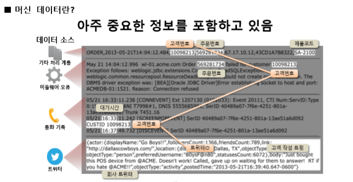
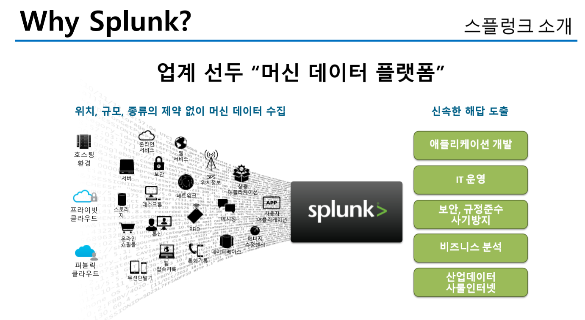
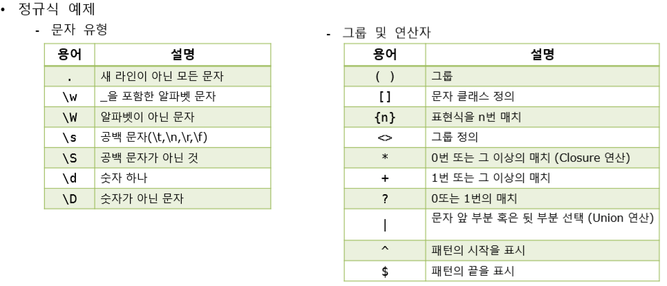
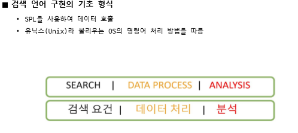

## 1 일차

**빅데이터의 특징**

3V - Volume, Velocity, Variety

4V - Volume, Velocity, Variability/Value

------
### Splunk

#### Splunk 의 특징
- 모든 데이터에 시간값을 부여함 그렇기 때문에 시계열 분석에 가장 적합함

- MapReduce 방식을 취함 
    - MapReduce 란 ?
        - Map : 임의의 순서로 정렬된 데이터 끼리 묶어서 분산 처리 하는 방법
        - Reduce : 맵에서 분산되어 있는 데이터를 다시 통합하는 방법
        

- 스키마 즉시 생성

- SQL 대신 SPL (Splunk Processing Language) 사용

#### Splunk 기능 및 용어
- Splunk Enterprise -> JE 랑 비슷한 느낌 
    - Search head : 검색된 결과 화면을 통합하여 사용자에게 제공
        - Indexr 에게 검색을 명령
        - CPU 많이 소요 
        - Splunk Daemon에 접근하여 검색 수행 
 
    - Indexr : 데이터 저장 및 검색 (저장소)
        - Index : 데이터 저장소(RDBMS와 같은 저장소)
        - Indexing : 원본 데이터를 Splunk가 검색 가능한 이벤트로 변환하여 저장하는 과정 
        - Parsing : 이벤트를 정규화된 필드로 분류(타임 스탬프 식별 )
        - Field : Parsing 한 values의 key

    - Deployment 
        - 로컬 및 분산 인스턴스 관리

    - Forwarder : 데이터를 수집하는 구성요소 
        - Heavy Forwarder : 원시 데이터 전송 
        - Universal Forwarder : 별도 설치 파일이 필요함, Heavy Forwarder 는 좀 무겁기 때문에 불 필요한 기능을 제거하고 데이터 수집만을 위한 Forwarder  (CPU 부하 적음, 데이터 필터링 및 수정 X )

    - Meta Data
        - index
            - 기본적으로 main 이라는 이름의 index
        - host
            - Data가 최초 발생된 곳의 정보 IP나 이름 host 명
            
        - source
            - 어디서 데이터를 가져왔는지 구분하기 위한 Field 따로 지정하지 않으면 파일의 경로
            
        - source type
            - 데이터 유형이 지정된 field
        
        - _time
            - 타임 스탬프를 표시한 field 
        
        - linecount
            - 원본 이벤트의 라인수 

#### Splunk 사용

C:\Program Files\Splunk\var\lib\splunk 경로에 보통 DB 가 폴더 형태로 저장 

ZIP 으로 묶여 있는 파일도 수집 가능

수집 방법 
 설정 -> 인덱스 해서 인덱스 생성 후
 설정 -> 데이터 추가 -> 데이터 선택 -> 다음
 host 명 설정 -> 인덱스 고르기
 
 
***XML 이나 json 도 인식 가능하지만 따로 설정해야함 ***

***한글 파일 불러 올때 고급으로 가서 인코딩 형식을 CP949 변경***

그리고 타임 스탬프는 따로 어떤 필드를 보고 지정해 줄 것인지 정해줄 수 있음
타임 스탬프 -> 고급 

CSV 형식은 테이블로 나타내기 쉬워 가능하지만 일반적인 로그는 테이블 형식으론 메타 정보 밖에 보이지 않아 리스트 방법 봐야합니다.

검색 한 후 시간 옆 화살표를 누르고 설정한다면 특정 필드만 추출도 가능함 

Splunk 에선 정규식으로 추출을 많이함 

            
         
***Search 명령어***
보통 파이프 라인으로 연결하여 진행함 (linux 와 비슷)

ex) index ="eco_car" sourctype="eco_car" | table "위도",경도" | where '위도' < '경도'

       

