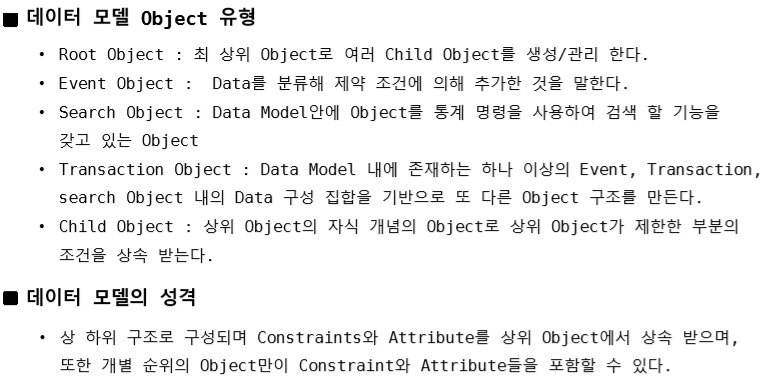
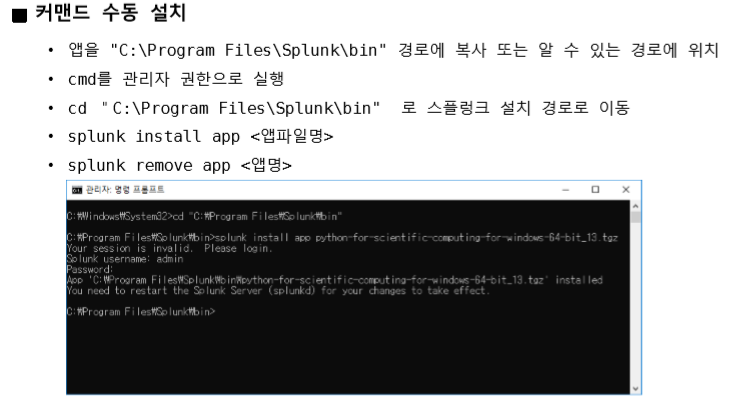

## 2 일차

### splunk 의 세부 기능

-------------
룩업 : 이벤트 데이터의 필드와 일치하는 필드를 외부 CSV 파일에서 참조 할 수 있는 기능 

쉽게 말해서 룩업 테이블과 조인이라 생각하면 됨 외부 파일과 조인 할 수 있는 것

inputlookup 과 outputlookup으로 나뉨 outputlookup은 검색을 룩업 테이블로 만드는 작업 , inputlookup은 룩업 파일을 보는거 

inputlookup 이라는 명령어로 사용 
ex) | inputlookup geo_attr_countries.csv

outputlookup 이라는 명령어 사용
ex) Index=_* | bucket _time span=1h | stats count by sourcetype _time | stats avg(count) as avg by sourcetype | outputlookup avg.csv

lookup 파일을 조인할 수도 있음
lookup이라는 명령어로 사용 

룩업 파일을 자동룩업 하기위해선 룩업 정의를 통하여 새 정의를 해줘야 함

룩업을 생성하거나 정의 하고 나면 권한 설정을 해줘야함 룩업 들어가서
해당 메뉴 들어가서 권한 누르면 설정 가눙 

--------------

데이터 모델 : 자주 사용하는 분석 방법을 미리 정의해 두고 사용할 수 있는 모형
- 설정이 저장되어 있다가 검색 시 Dynamic하게 반영
- 특화된 검색과 분석을 가능하게 하는 pivot 바탕

즉 다음에 검색할 때 더 빨리 검색 할 수 있음 

여러 Object로 이루어져 있음

설정에서 데이터 모델 들어가서 만들어 줄 수 있음 

pivot : SPL에 대한 지식 없어도 쉽게 차트를 만들 수 있게 지원하는 기능

모델 화면에서 Pivot 누르면 가능 

--------------

Splunk App

플러그인 같은 느낌

-----------

대시보드 -> 시각화

쿼리의 결과를 보고서로 만들어서 관리 할 수 있음
차트로 만들어서 대시보드에 추가하거나 내용을 보고서로 관리하거나 할 수 있음.

***대시보드는 미리 정의된 검색, 차트 , 경고 및 보고서, 뷰를 시각화하여 쉡게 웹상에서 관리 할 수 있는 환경 제공***

------------

## Neo4J

시계열에 적합한 Splunk와 달리 Neo4J 는 관계를 중요시한 데이터를 다룸에 적합하다.
그래프형으로 표시하는 정보를 가져오기 좋음 기존 RDB같은 경우는 관계를 나타냐려고 하면 join 과정을 거쳐야함으로 퍼포먼스가 저해된다. 
***하나하나를 노드라고 하고 노드들은 하나 이상의 관계를 가질 수 있다*** 

