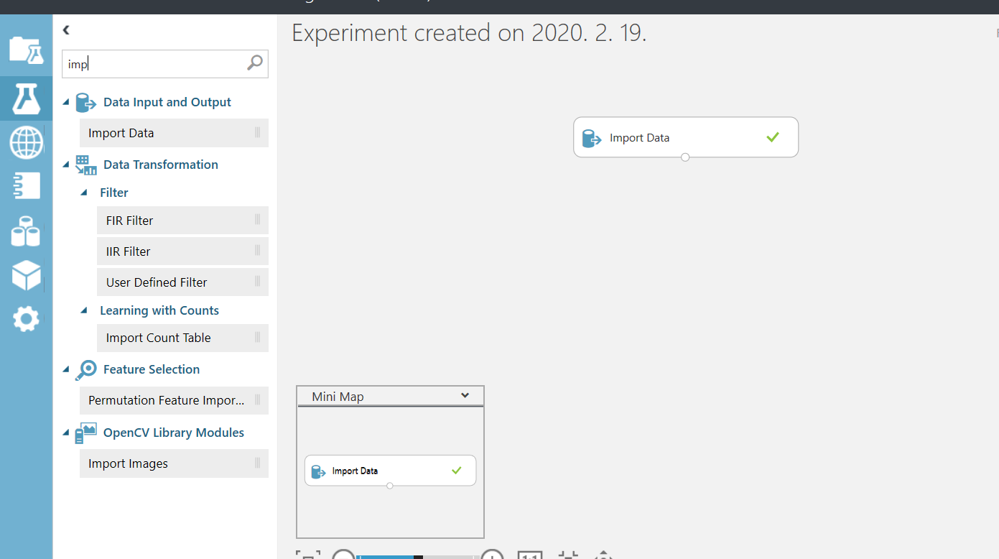
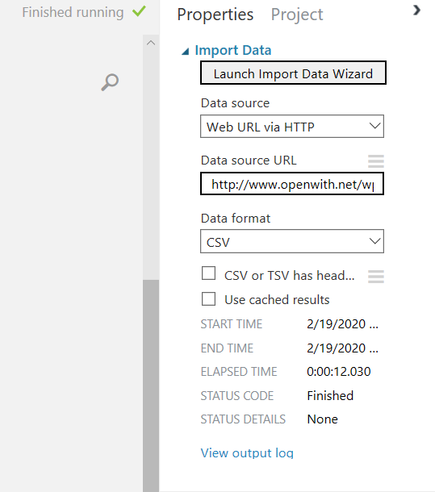
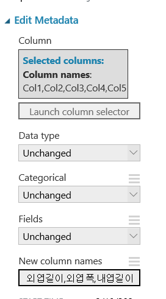
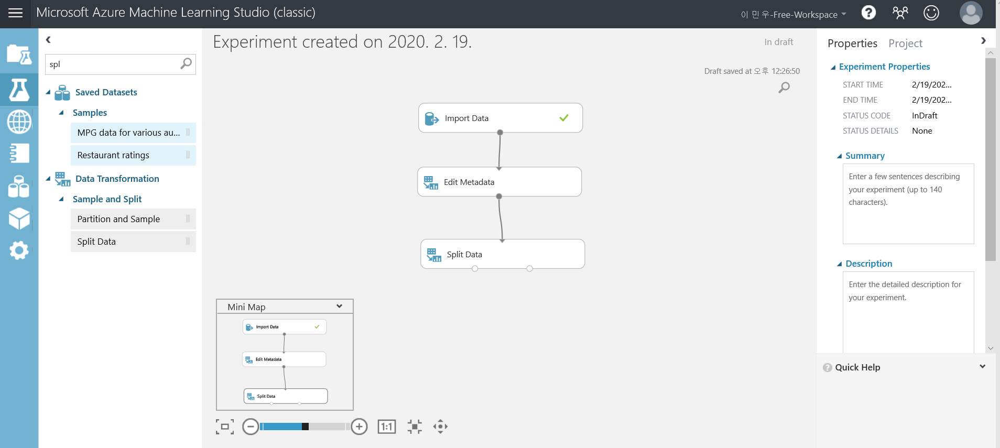
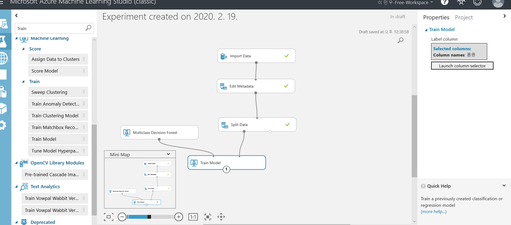
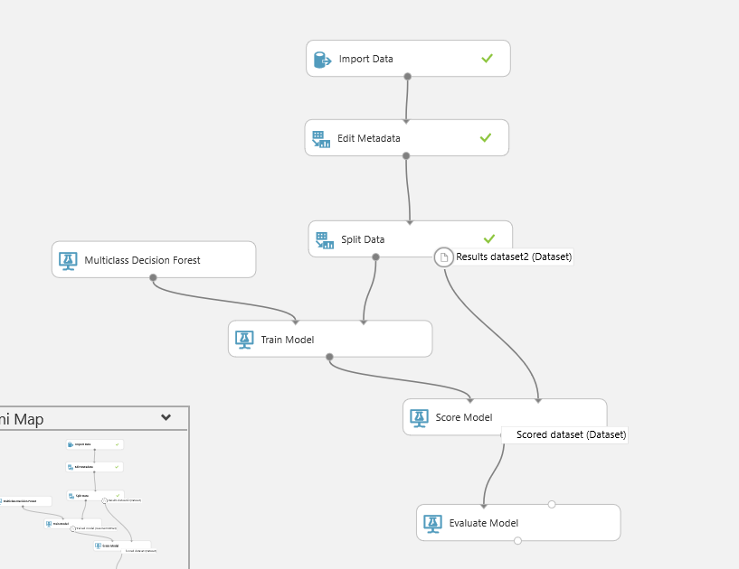
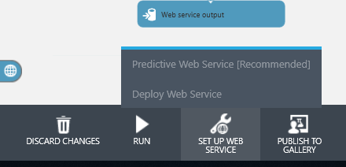
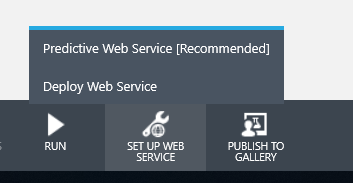

## 3 일차

AzureML

드래그 앤 드롭 방식으로 진행하는 MLToolKit

### 실습

iris data 로 진행 

우선 데이터를 먼저 가져옴
아래 보듯이 Import Data를 끌어다두고 어떤 데이터를 불러올지 정할 수 있음 url로 정할 수 있고 파일로 정할 수 있음 

edit 을 끌어다 컬럼명 같은걸 수정할 수 있음

tring-test split 
비율을 설정하면 왼편에 있는게 설정한 비율 지금 0.7로 설정 

train
0.7로 학습

eval
test set으로 평가 

최종 평가를 하기 위해선 웹서비스화 해서 진행
보이는 버튼 누르고 retrain web 머시기 누르고 런
후 predict 누르고 런 하고 depoly web 시킴 

